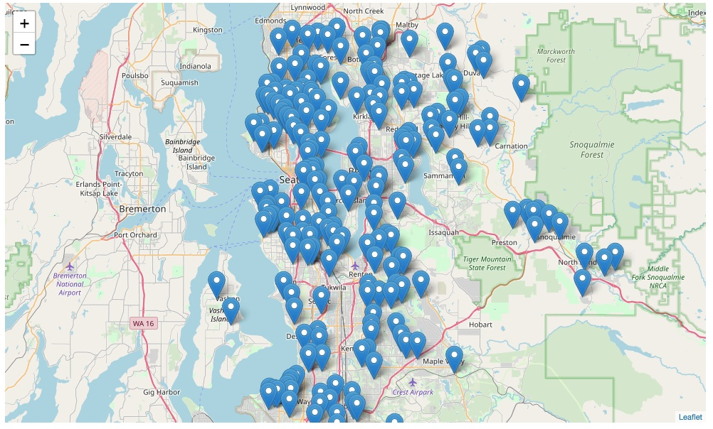
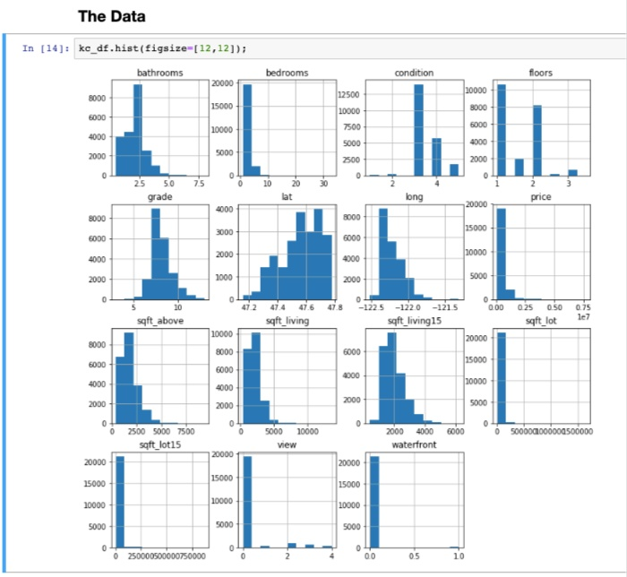
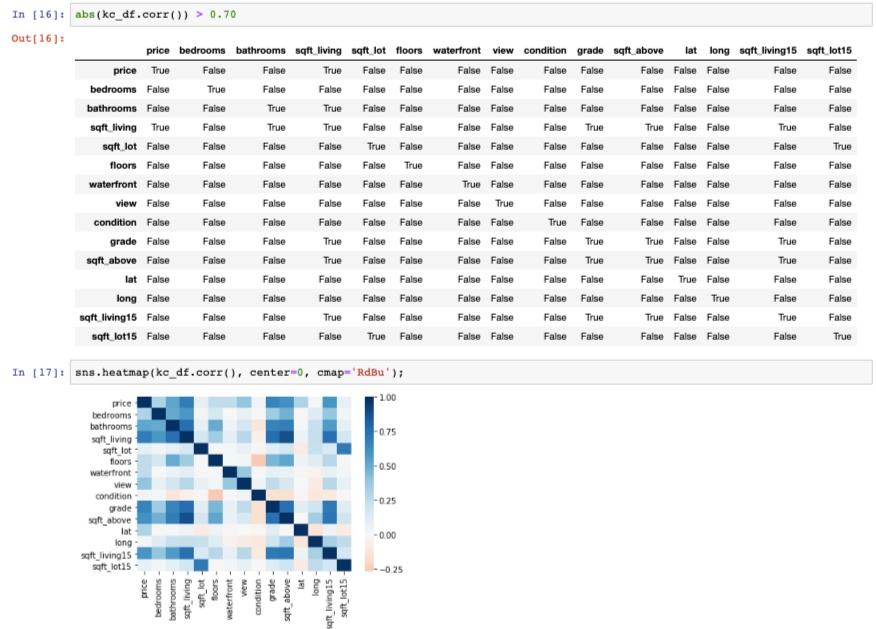
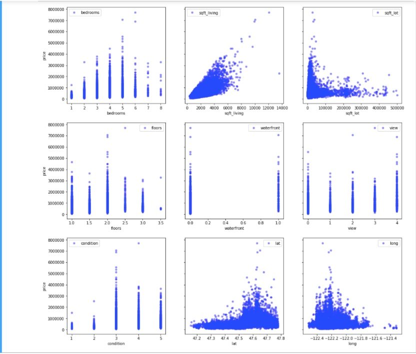
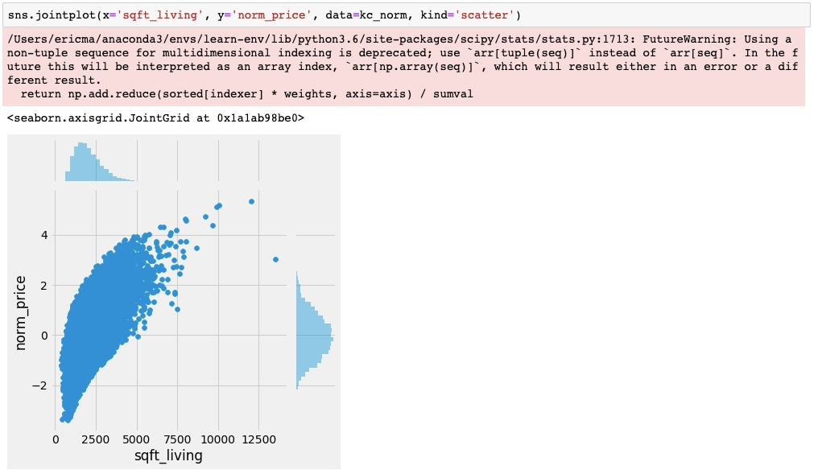
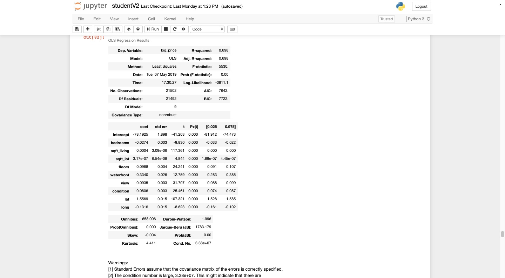
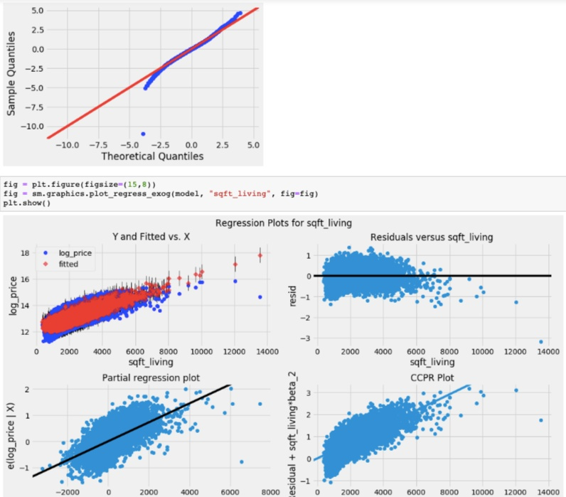
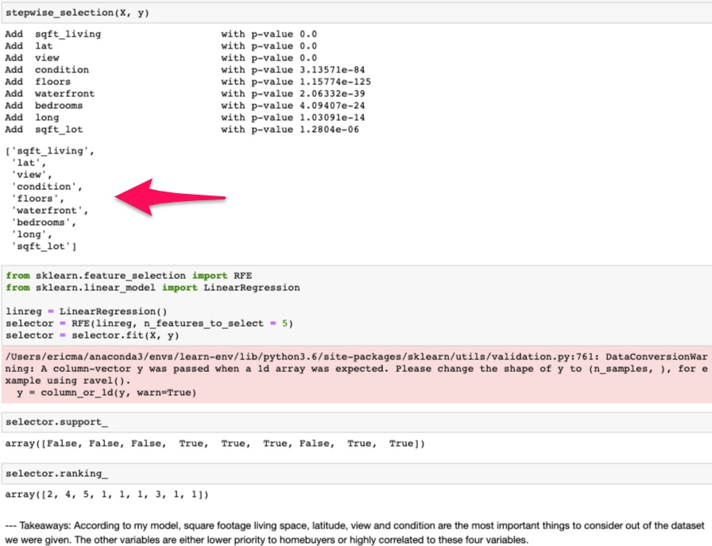

# Module1 Project1

#      **Flatiron School**
#### *Eric Ma: Data Analyst*
#### *May 8 2019*
---
### King County 2014-15 Housing Data

Creating the model of the 2014-15 King County Housing Data. Lets look at where
our data comes from. Here's a sample of 216 houses in King County

### Data Cleaning
My initial goal was to remove as many columns to really narrow the dataset used.
Over the course of the project I brought back more columns but to improve my
modeling in the future I've learned to be extra discerning about what to
eliminate.

My top-line eliminations are 'id', 'yr_renovated', 'zipcode'. These are the sets
that have the least useful information because id seems to be a randomly
generated. Year renovated is missing too much information. Zip code is already
represented by the latitude and longitude. In the future I will look into
investigating missing data like year renovated further. As someone who is
interested in demographic data I'd be interested in downloading a dataset that
lists latitude and longitude values for every zip code in the US

I was concerned about multicolinearity. With so many data points theres just too
much dependencies. This is particularly true for subjective measures like view,
and grade. People who report a better grade will be more likely to be looking at
a spacious waterfront view. My observations showed that 'bathrooms', 'grade',
'sqft_above', 'sqft_basement', 'sqft_living15', 'sqft_lot15' were all
significantly colinear (corr > 0.7). I dropped those values. In the future I
would prefer to deal with them differently. The Scikit Learn model assumes in
the backend independent variables.

There is significant skew in the data provided. That is understandable given
there aren't that many people capable of shelling out 2M+ for a home. Some of
these are clear outliers. There is a house with 33 bedrooms in this dataset.
Hunting down these outliers was the bulk of my time. I also tried to unskew
some data by log transforming some of it. Namely the price column. I justify
this by the sparesness and the variance of the tails and by money data in
general naturally following a exponential growth. A million dollars has a
different context to the working class than it does to the billionaire class.

### My model
After the log transform my model performed much better. The variables left to
descern are 'bedrooms', 'sqft_living', 'sqft_lot','floors', 'view', 'condition',
'waterfront', 'lat', 'long'.

Even with enthusiastic pruning of the data my model is 70% confident (R^2=0.698)
with MSE of 0.301. That does not mean the model is shockingly predictive. Log
scaling the target also log scales the errors making the MSE meaningless until
adjusted. In the future I will look into feature scaling to exponentials rather
than target scaling.
# Module2
